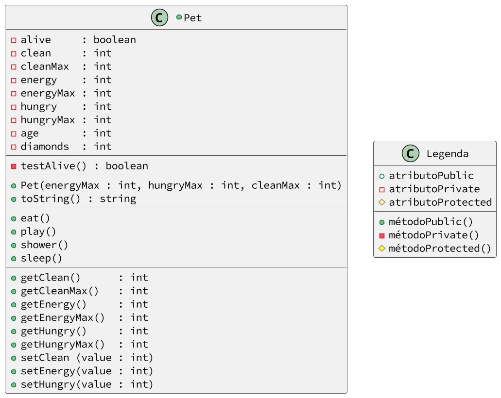

# Tamagotchi 💎 & Utilizando sets para controlar a variação dos status do bichinho


[](toc)

- [Intro](#intro)
- [Guide](#guide)
- [Shell](#shell)
    - [Exemplo 1](#exemplo-1)
    - [Exemplo 2](#exemplo-2)
    - [Exemplo 3](#exemplo-3)
[](toc)


Você deve implementar um simulador de bichinho virtual. Ele poderá comer, brincar, dormir e tomar banho. E eventualmente morrerá, se você não cuidar bem dele.


***
## Intro
Seu sistema deverá:

- **Inicializar**
    - passando energia, saciedade e limpeza máximas do pet.
    - Todos os níveis devem ser iniciados no máximo na criação do pet.
    - Os outros atributos são 
        - diamantes, que ele vai ganhar jogando.
        - e idade que aumenta a cada ação realizada, 
        - ambos iniciando em 0.
- **Comendo, Jogando, Dormindo e tomando banho**
    - Cada operação causa aumento e reduções nos atributos.
    - Nenhum atributo pode passar do máximo ou ir abaixo de 0.
- **Morrendo**
    - Se algum atributo chegar a 0, o pet morre e nenhuma ação pode ser feita a não ser mostrar os dados.


***
## Guide


- [solver.cpp ](.cache/draft.cpp)
- [solver.java](.cache/draft.java)
- [solver.ts  ](.cache/draft.ts)

[](https://youtu.be/X6SV1izH67w)

***
## Shell
### Exemplo 1

```bash
#__case inicio
# O comando "$init energia saciedade limpeza" recebe os valores do pet.
# O pet inicia com 0 diamantes e 0 de idade.
# Toda vez que $init é chamado, um novo pet é criado.
$init 20 10 15
# O comando "$show" mostra os parâmetros do Pet na seguinte ordem
# Energia/Max, Saciedade/Max, Limpeza/Max, Diamantes, Idade
$show
E:20/20, S:10/10, L:15/15, D:0, I:0
$init 10 20 50
$show
E:10/10, S:20/20, L:50/50, D:0, I:0
$end
```

```bash
#__case play - Brincar 
# O comando "$play" altera em -2 energia, -1 saciedade, -3 limpeza, +1 diamante, +1 idade.
$init 20 10 15
$play
$show
E:18/20, S:9/10, L:12/15, D:1, I:1
$play
$show
E:16/20, S:8/10, L:9/15, D:2, I:2

#__case comer 
# O Comando "$eat" altera em -1 a energia, +4 a saciedade, -2 a limpeza, +0 diamantes,  +1 a idade
$eat
$show
E:15/20, S:10/10, L:7/15, D:2, I:3

#__case dormir
# O Comando "$sleep" aumenta energia até o máximo e idade aumenta do número de turnos que o pet dormiu.
# Também perde 1 de saciedade.
$sleep
$show
E:20/20, S:9/10, L:7/15, D:2, I:8

#__case tomar banho
# O comando "$shower" alteram em -3 energia, -1 na saciedade, MAX na limpeza, +0 diamantes, +2 na idade.
$shower
$show
E:17/20, S:8/10, L:15/15, D:2, I:10

#__case dormir sem sono
# Para dormir, precisa ter perdido pelo menos 5 unidades de energia
$sleep
fail: nao esta com sono

#__case morrer
# Se algum atributo atingir 0, o pet morre e não poderá executar nenhuma ação
$play
$play
$play
$play
$show
E:9/20, S:4/10, L:3/15, D:6, I:14
$play
fail: pet morreu de sujeira
$show
E:7/20, S:3/10, L:0/15, D:7, I:15
$play
fail: pet esta morto
$eat
fail: pet esta morto
$shower
fail: pet esta morto
$sleep
fail: pet esta morto
$end
```

### Exemplo 2
```bash
#__case fraqueza
$init 5 10 10
$play
$play
$play
fail: pet morreu de fraqueza
#__case morto de fraqueza
$play
fail: pet esta morto
$show
E:0/5, S:7/10, L:1/10, D:3, I:3
$end
```

### Exemplo 3
```bash
#__case fome
$init 10 3 10
$play
$play
$play
fail: pet morreu de fome
$play
fail: pet esta morto
$show
E:4/10, S:0/3, L:1/10, D:3, I:3
$end
```

