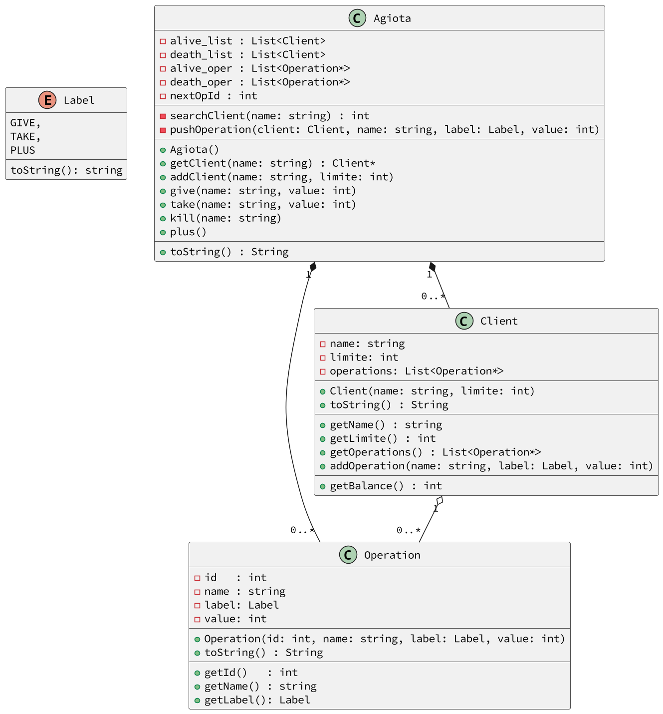

# Agiota


[](toc)

- [Explicação](#explicação)
- [Intro](#intro)
- [Guide](#guide)
- [Shell](#shell)
- [Fim da história](#fim-da-história)
[](toc)

Ptolomeu é o agiota mais carismático de MoneyVille. Sem "nenhuma razão" foi denunciado e acabou indo pra cadeira. O problema foi que ele afirma que quem implementou o software de controle dos empréstimos e quem apagou os registro dos defuntos foi você.

Seu Plutolomeu é um agiota que empresta dinheiro a juros de 10%. Ele é uma pessoa "muito carismática e amiga de todos". De vez em quando os clientes dele desaparecem, mas ele diz que é só coincidência. "A vida é um sopro e basta estar vivo pra morrer", segundo ele.

Vamos abstrair um pouco da história de Plutolomeu e analisar o sistema de empréstimos que ele tinha instalado em seu computador.

***

## Explicação

[]([Vídeo](https://youtu.be/5pnagWZvjBE))

## Intro

- Cadastrar Clientes
  - Cada cliente cadastrado tem um codenome único e um limite de crédito que ele pode ficar devendo ao agiota.
- Emprestar Dinheiro.
  - Empréstimos são salvos como Transações de GIVE (porque ele dá com todo carinho) e são armazenadas tanto na lista do agiota como nos objetos dos clientes.
  - Cada transação deve receber do sistema um identificador numérico crescente.
  - A primeira transação tem id 0. A segunda tem id 1 e etc.
  - Uma transação tem um id inteiro, um nome de cliente, um label e um valor numérico.
  - Os labels das transções podem ser
    - GIVE: quando o agiota dá dinheiro pra pessoa.
    - TAKE: quando o agiota "pega" o dinheiro da pessoa.
    - PLUS: quando o agiota decide que é hora de cobrar juros e as dívidas de todos aumentam em 10%.
  - Os valores das transações sempre são positivos. Ptolomeu não entende números negativos. O que define se é entrada ou saída é o label.
- Mostrar todos os clientes com o saldo de cada um.
- Mostrar o histórico de transações de Ptolomeu.
- Receber dinheiro.
  - Clientes pagam os empréstimos aos poucos. (As vezes, eles não pagam, mas seu Ptolomeu dá um jeito de pegar).
- Matar um cliente.
  - As vezes Ptolomeu dá um chá de sumiço em quem não paga suas dívidas.
    - Pra não deixar pontas soltas ele move o cliente da lista de clientes vivos para a lista de clientes mortos.
    - Também retira as transações relacionadas ao cliente morto do histórico de transações dos vivos e move para o histórico de transações dos mortos.
    - Ele disse que quando você implmentou, você queria apagar complementamente os mortos do sistema, mas ele disse que ia ficar com saudade, por isso pediu a lista dos mortos.
- O Classe cliente:
  - Não possui um objeto saldo. Para calcular o saldo, percorra o vetor de operações do cliente somando o que for entrada (GIVE) e retirando do que for saída (TAKE, PLUS).
- Na hora de efetuar os juros.
  - Se por acaso alguém, por causa dos juros, tiver devendo mais do que o limite, essa pessoa também vai pro saco. Perdão, pra lista do mortos.
- As transações:
  - O mesmo objeto transação é compartilhado entre o histórico do agiota e o histórico do cliente correspondente.
- A lista dos mortos não são mortos de verdade, estão mortos no coração de Ptolomeu apenas, porque ele desistiu de cobrar a dívida. É o que ele disse pra polícia.

## Guide

- [draft.cpp](.cache/draft.cpp)



## Shell

```bash
#__case cadastrar
$addCli maria 500
$addCli rubia 60
$addCli maria 300
fail: cliente ja existe

#__case emprestar
$give maria 300
$give rubia 50
$give maria 100

#__case show
# Mostra os cliente ordenados por codenome
# Mostra as operações pela ordem que elas ocorreram
$show

:) maria 400/500
:) rubia 50/60
+ id:0 give:maria 300
+ id:1 give:rubia 50
+ id:2 give:maria 100

# __case erros no emprestimo
$give bruno 30
fail: cliente nao existe

$give rubia 30
fail: limite excedido

$show
:) maria 400/500
:) rubia 50/60
+ id:0 give:maria 300
+ id:1 give:rubia 50
+ id:2 give:maria 100

#__case receber dinheiro
$take maria 350
$take rubia 1
$take maria 10

$show
:) maria 40/500
:) rubia 49/60
+ id:0 give:maria 300
+ id:1 give:rubia 50
+ id:2 give:maria 100
+ id:3 take:maria 350
+ id:4 take:rubia 1
+ id:5 take:maria 10

#__case getCli
$showCli maria
maria 40/500
id:0 give:maria 300
id:2 give:maria 100
id:3 take:maria 350
id:5 take:maria 10

#__case matar
$kill maria
$show
:) rubia 49/60
+ id:1 give:rubia 50
+ id:4 take:rubia 1
:( maria 40/500
- id:0 give:maria 300
- id:2 give:maria 100
- id:3 take:maria 350
- id:5 take:maria 10

$end
```

***

```bash
#__case cadastrar
$addCli maria 500
$addCli rubia 60
$addCli josue 200

$give maria 430
$give josue 170
$give rubia 30

#__case show
$show
:) josue 170/200
:) maria 430/500
:) rubia 30/60
+ id:0 give:maria 430
+ id:1 give:josue 170
+ id:2 give:rubia 30

# aumenta a divida de todos de 10%
# arredondado pra cima
#__case rendimento
$plus

$show
:) josue 187/200
:) maria 473/500
:) rubia 33/60
+ id:0 give:maria 430
+ id:1 give:josue 170
+ id:2 give:rubia 30
+ id:3 plus:josue 17
+ id:4 plus:maria 43
+ id:5 plus:rubia 3

#__case cobrar e matar
# se na hora do juros, o valor passar
# do limite, eles morrem

$plus

$show
:) rubia 37/60
+ id:2 give:rubia 30
+ id:5 plus:rubia 3
+ id:8 plus:rubia 4
:( josue 206/200
:( maria 521/500
- id:1 give:josue 170
- id:3 plus:josue 17
- id:6 plus:josue 19
- id:0 give:maria 430
- id:4 plus:maria 43
- id:7 plus:maria 48

$end
```

## Fim da história

- Então assim ficou Ptolomeu, depois de ir para a prisão e ver sua fortuna confiscada.
- Se foi presídio, zoológico ou hospital psiquiátrico, ninguém comenta, só sabemos que ele nunca mais foi visto. Pelo menos não em Moneyville.


