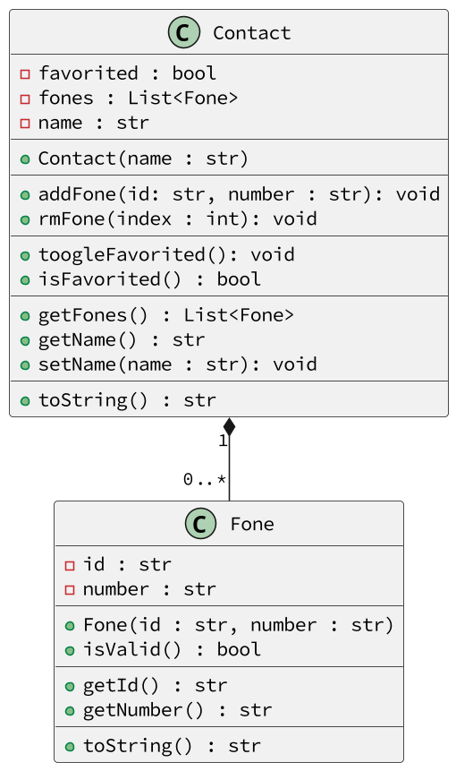

# Contato


[](toc)

- [Intro](#intro)
- [Guide](#guide)
- [Shell](#shell)
[](toc)

O objetivo dessa atividade é implementar uma classe responsável por guardar um **único** contato da agenda telefônica do seu celular. Cada contato pode ter vários telefones.

Essa classe Contact será reutilizada nas atividades @015 Busca e @016 Favoritos.

## Intro

Seu programa deve:

- **Definir nome**
  - Poder inicializar o contato passando o nome.
    - Se já houver contato, inicie um novo contato.
    - Se não houver nome, o nome default é "".
- **Inserir telefones no contato**
  - Um telefone tem um label e um fone.
  - Labels serão nomes como: casa, fixo, oi.
  - Labels podem ser duplicados.

```sh
# Exemplo de saída
- ana [tim:3434, casa:4567, oi:8754, casa:4567, oi:8754]
```
- **Remover telefones do contato.**
  - Remove os telefones pelo índice.
- **Validando os números de telefone.**
  - Processe os telefones para apenas permitir nos telefones os seguintes caracteres "0123456789()."
  - Se o usuário tentar inserir individualmente um telefone invalido, avise e não insira o telefone.
- **Favoritar e desfavoritar contato**
- **Mostrar contato**
  - Mostrar o contato com todos os telefones.
  - Se ele for favoritado, mostre um @ no começo do nome.

***

## Guide



[](load)[](diagrama.puml)[](filter:fenced:plantuml)

```plantuml

class Fone {
  - id : str
  - number : str
  __
  ' inicializa as variaveis
  + Fone(id : str, number : str)
  
  ' verifica se o número é um número de telefone válido
  ' crie uma str "validos" com todos os caracteres válidos
  ' para cada caractere c do número:
  '   se c não estiver em validos:
  '     retorne false
  ' retorne true
  + isValid() : bool
  __
  + getId() : str
  + getNumber() : str
  __
  ' Gera uma string para impressão
  ' ex: oi:1234
  + toString() : str
}

class Contact {
  - favorited : bool
  - fones : List<Fone>
  - name : str
  __
  
  ' inicialize o fone com o nome, favorited como false e a lista de fones vazia
  + Contact(name : str)
  __
  ' se fone for válido:
  '   insira no fim da lista de fones
  ' se não:
  '   informe o erro
  + addFone(id: str, number : str): void
  
  ' se o índice existir:
  '   remove o fone pelo indice
  + rmFone(index : int): void
  
  __
  ' favorita ou desfavorita o contato
  + toogleFavorited(): void

  ' retorna se o contato está favoritado
  + isFavorited() : bool
  __
  + getFones() : List<Fone>
  + getName() : str
  + setName(name : str): void

  __
  ' use um contador para mostrar o índice do telefone
  ' use o toString do fone para adicioná-lo à saída
  ' se o contato estiver favoritado, adicione um @ antes do nome
  ' o resultado dever ficar assim:
  ' ex: - david [oi:123, tim:9081, claro:5431]
  + toString() : str
}


```

[](load)

***

## Shell

```bash
#__case definindo nome
$init david
$show
- david []

#__case inserindo telefones
$add oi 88
$add tim 99
$add tim 98
$add vivo 83
$show
- david [oi:88, tim:99, tim:98, vivo:83]

#__case removendo telefone por indice
$rm 2
$show
- david [oi:88, tim:99, vivo:83]
$rm 0
$show
- david [tim:99, vivo:83]

#__case validando numero de fone
$add tim 9a9
fail: invalid number
$add tim (85)99.99
$show
- david [tim:99, vivo:83, tim:(85)99.99]

#__case favoritos
$tfav
$show
@ david [tim:99, vivo:83, tim:(85)99.99]

$tfav
$show
- david [tim:99, vivo:83, tim:(85)99.99]


$end
#__end__
```
