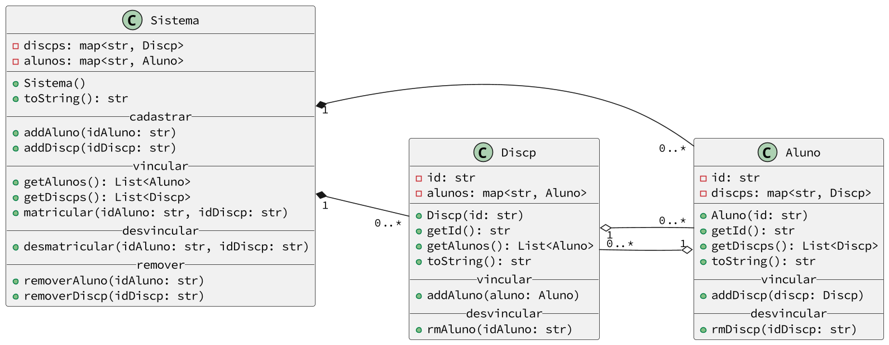

# Matrícula & Associação NxN


[](toc)

- [Funcionalidades](#funcionalidades)
- [Shell](#shell)
- [Main em Java](#main-em-java)
- [Diagrama UML](#diagrama-uml)
- [Métodos](#métodos)
- [Main interativa](#main-interativa)
- [Recursos Extras](#recursos-extras)
[](toc)


Vamos criar um sistema da cadastro de alunos e disciplinas. Após isso, vamos matricular e remover alunos das disciplinas. Aqui, cada aluno sabe quais as disciplinas em que está matriculado e a disciplina sabe os alunos que ela contém.

## Funcionalidades

- **Repositórios Individuais - 3.0 P**
    - Adicionar aluno passando id do aluno.
    - Mostrar os todos os alunos cadastrados.
    - Adicionar disciplina passando o id da disciplina.
    - Mostrar as todas as disciplinas cadastradas.

- **Realizar Matrícula - 4 P**
    - Matricular o aluno em uma ou mais disciplinas.
    - Mostrar as disciplinas de um aluno.
    - Mostrar os alunos de uma disciplina.

- **Desmatricular - 2.0 P**
    - Remover disciplinas de um aluno.

- **Removendo alunos do sistema - 1.0 P**
    - Remover aluno mantendo a integridade das relações.
    - Remover disciplinas mantendo a integridade das relações

## Shell

```bash
#__case adicionando alunos ao sistema
# nwalu _name _name ...
$nwalu alice edson bruno

# adicionando disciplinas ao sistema
# nwdis _disc _disc
$nwdis poo aps
$nwdis fup

# show mostra alunos e disciplinas
$show
alunos:
    alice [ ]
    bruno [ ]
    edson [ ]
discps:
    aps [ ]
    fup [ ]
    poo [ ]

#__case matriculando alunos
# tie _aluno _disc _disc ...
$tie bruno fup aps poo
$tie alice fup poo
$tie edson fup

$show
alunos:
    alice [ fup poo ]
    bruno [ aps fup poo ]
    edson [ fup ]
discps:
    aps [ bruno ]
    fup [ alice bruno edson ]
    poo [ alice bruno ]

#__case desmatriculando alunos
# untie _aluno _disc _disc ...
$untie bruno poo aps
$show
alunos:
    alice [ fup poo ]
    bruno [ fup ]
    edson [ fup ]
discps:
    aps [ ]
    fup [ alice bruno edson ]
    poo [ alice ]

#__case removendo alunos do sistema
# rmalu _aluno
$rmalu alice

$show
alunos:
    bruno [ fup ]
    edson [ fup ]
discps:
    aps [ ]
    fup [ bruno edson ]
    poo [ ]
$end
```

## Main em Java
```java

public static void main(String[] args) {
    Sistema sys = new Sistema();
    for(String id : Arrays.asList("alice", "edson", "bruno"))
        sys.addAluno(id);
    for(String id : Arrays.asList("fup", "aps", "poo"))
        sys.addDiscp(id);
    System.out.println(sys);
// check
    for(String id : Arrays.asList("fup", "aps", "poo"))
        sys.matricular("bruno", id);
    for(String id : Arrays.asList("fup", "poo"))
        sys.matricular("alice", id);
    sys.matricular("edson", "fup");
    System.out.println(sys);
// check
    sys.desmatricular("bruno", "poo");
    sys.desmatricular("bruno", "aps");
    System.out.println(sys);
// check
    sys.rmAluno("alice");
    System.out.println(sys);
// check
}

```

## Diagrama UML



## Métodos
<!--FILTER diagrama.puml plantuml-->
```plantuml
@startuml
skinparam defaultFontName "JetBrains Mono Medium"
class Aluno {
    '
    - id: str
    '
    - discps: map<str, Discp>
    __
    '
    + Aluno(id: str)
    '
    + getId(): int
    '
    + getDiscps(): List<Discp>
    '
    ' retorna o nome do aluno e o nome das disciplinas matriculadas
    + toString(): str
    '
    __vincular__
    ' 
    ' cria o vínculo bidirecional aluno disciplina
    + matricular(discp: Discp)
    '
    __desvincular__
    '
    + desmatricular(idDiscp: str)
}
class Discp {
    '
    - id: str
    '
    - alunos: map<str, Aluno>
    __
    '
    + Discp(id: str)
    '
    + getId(): int
    '
    + getAlunos(): List<Aluno>
    '
    ' mostra o id da disciplina e o nome dos alunos matriculados
    + toString(): str
    '
    __vincular__
    ' 
    ' cria o vínculo bidirecional aluno disciplina
    + matricular(aluno: Aluno)
    '
    __desvincular__
    '
    + desmatricular(idAluno: str)
}
class Manager <V> {
    '
    - map: map<V>
    '
    + Manager()
    '
    ' adiciona se não existir e lança exceção se já existir
    + add(key: str, value: V)
    '
    ' remove se existir e lança exceção se não existir
    + get(key: str): V
    '
    ' remove se existir e lança exceção se não existir
    + rm(key: str)
    '
    + keys(): List<str>
    '
    + values(): List<V>
    '
    ' retorna o texto dos valores inseridos
    + toString(): str
}
class Sistema {
    '
    - discps: Manager<Discp>
    '
    - alunos: Manager<Aluno>
    '
    __
    '
    + Sistema(username : str)
    '
    ' mostra os alunos e disciplinas cadastradas
    + toString(): str
    '
    __cadastrar__
    '
    ' adiciona um aluno com esse id no sistema
    + addAluno(idAluno: str)
    '
    ' adiciona uma disciplina com esse id no sistema
    + addDiscp(idDiscp: str)
    '
    __vincular__
    '
    + getAlunos(): Manager<Aluno>
    '
    + getDiscps(): Manager<Discp>
    ' 
    ' recupera os objetos aluno e disciplina e vincula-os
    + matricular(idAluno: str, idDiscp: str)
    '
    __desvincular__
    '
    + desmatricular(idAluno: str, idDiscp: str)
    '
    __remover__
    '
    ' remove um aluno com esse id do sistema desfazendo todos os vínculos
    + removerAluno(idAluno: str)
    '
    ' remove uma disciplina com esse id do sistema desfazendo todos os vínculos
    + removerDiscp(idDiscp: str)
}
Sistema "1" -* "0..*" Aluno
Sistema "1" -* "0..*" Discp
Aluno "1" --o "0..*" Discp
Aluno "1" o-- "0..*" Discp
@enduml
```
<!--FILTER_END-->

## Main interativa

```c++
int main(){
    string line, cmd;
    Sistema sistema;
    while(true){
        try{
            getline(cin, line);
            cout << "$" << line << endl;
            stringstream ss(line);
            //cria um vetor de strings a partir de line
            vector<string> ui(istream_iterator<string>{ss}, istream_iterator<string>());
            string cmd = ui[0];
            if(cmd == "end"){
                break;
            }else if(cmd == "nwalu"){
                for(size_t i = 1; i < ui.size(); i++)
                    sistema.addAluno(ui[i]);
            }else if(cmd == "nwdis"){
                for(size_t i = 1; i < ui.size(); i++)
                    sistema.addDiscp(ui[i]);
            }else if(cmd == "show"){
                cout << sistema;
            }else if(cmd == "tie"){
                for(size_t i = 2; i < ui.size(); i++)
                    sistema.matricular(ui[1], ui[i]);
            }else if(cmd == "untie"){
                for(size_t i = 2; i < ui.size(); i++)
                    sistema.desmatricular(ui[1], ui[i]);
            }else if(cmd == "rmalu"){
                sistema.rmAluno(ui[1]);
            }else{
                cout << "comando invalido " << "[" << cmd << "]\n";
            }
        }catch(string e){
            cout << e << endl;
        }
    }
}
```


***

## Recursos Extras
- [Comandos de teste](resources/testes.tio)
- [Modelo em C++](resources/raiox.cpp)
- [Exemplo Main em C++](resources/exemplo_main.cpp)
