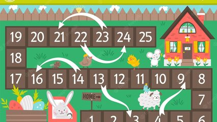
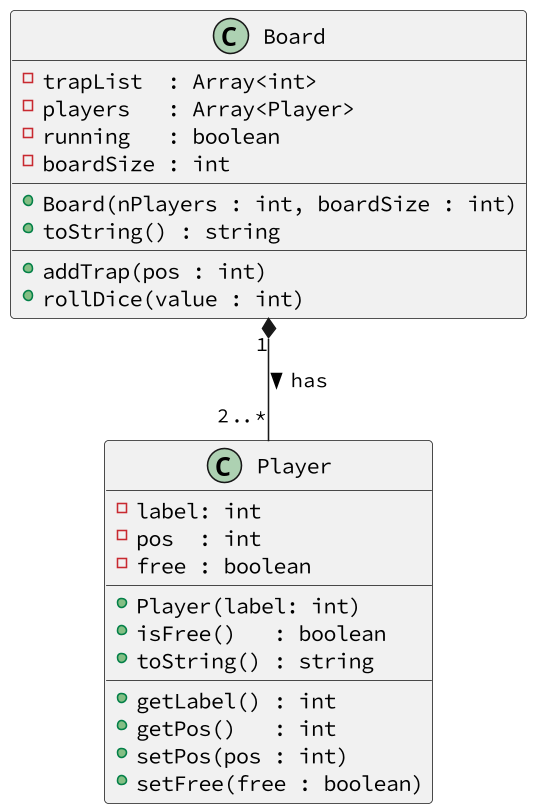

# Tabuleiro



[](toc)

- [Intro](#intro)
- [Guide](#guide)
- [Shell](#shell)
[](toc)

## Intro

Nosso jogo consiste em um tabuleiro contendo uma trilha de quadrados e um conjunto de peças coloridas. No início do jogo, cada jogador recebe uma peça; todas as peças são inicialmente posicionadas na posição 0 da trilha.

O jogo prossegue em rodadas. Em cada rodada, os jogadores rolam um D20 (dado de 20 faces) e movem suas peças para frente um número de quadrados igual ao resultado obtido pelos dados. Os jogadores rolam os dados sempre na mesma ordem (jogador A, depois jogador B, etc.) nas rodadas.

A maioria dos quadrados no tabuleiro são quadrados simples, mas alguns são “armadilhas”. Se a peça de um jogador cair em um quadrado da armadilha no final do movimento do jogador. O jogador ficará preso na armadilha até que na sua rodada jogue um número par se libertando da armadilha. Ao rolar um número par e se libertar da armadilha, sua peça não se move nessa rodada, mas na próxima poderá se mover normalmente.


Haverá exatamente três armadilhas na trilha.

O vencedor do jogo é o jogador cuja peça chega primeiro ao final da trilha. O fim da trilha é depois da última casa do tabuleiro. Considere, por exemplo, a placa da figura acima, que tem quadrados numerados de 1 a 48. No início, as peças são posicionadas no local marcado como 'Início', ou seja, antes do quadrado número 1. Portanto, se um jogador rolar um 7, sua peça é posicionada na casa número 7 no final da primeira rodada do jogo.
Além disso, se a peça de um jogador estiver posicionada na casa 41, o jogador precisa de um resultado de rolagem de pelo menos 8 para chegar ao final da trilha e ganhar o jogo. Observe também que não haverá empate no jogo.

___

Questão adaptada da maratona ACM 2003 por @WladimirTavares

___

## Guide

- [solver.ts](.cache/draft.ts)
- [solver.cpp](.cache/draft.cpp)
  


[](load)[](diagrama.puml)[](fenced:filter:plantuml)

```plantuml
  class Player {

    ' numero do jogador
    - label: int  

    ' posição dele no tabuleiro
    - pos  : int

    ' se ele poderá andar no proximo roll ou ainda esta preso
    - free : boolean
    __

    ' inicialize o jogador
    + Player(label: int)

    ' retorna this.free
    + isFree()   : boolean

    + toString() : string
    __
    + getLabel() : int
    + getPos()   : int
    + setPos(pos : int)
    + setFree(free : boolean)
  }

  class Board {
    
    ' lista com as posições do tabuleiro que tem armadilhas
    - trapList  : Array<int>

    ' lista com os jogadores
    - players   : Array<Player>

    ' se o jogo ainda esta acontecendo ou ja acabou
    - running   : boolean

    ' o tamanho do tabuleiro
    - boardSize : int
    __
    
    ' inicialize o tabuleiro
    ' crie uma lista vazia para as armadilhas
    ' crie uma lista vazia para os jogadores
    ' faça um laço criando os jogadores e adicionado à lista de jogadores
    ' inicialize o tamanho do tabuleiro em boardSize + 1
    ' pois o tabuleiro começa em 0
    + Board(nPlayers : int, boardSize : int)

    ' imprime o tabuleiro
    + toString() : string
    __
    ' adiciona uma armadilha na posição pos
    ' trapList.push(pos)
    + addTrap(pos : int)

    ' faz toda a lógica da jogada
    ' verifique se o jogo ainda está em andamento
    ' pegue o primeiro jogador
    ' se ele estiver preso
    '   veja se a jogada é par e liberta ele
    ' se ele estiver livre
    '   faça ele andar
    '   veja se ele caiu em uma armadilha
    '   ou se ele chegou no final do tabuleiro
    ' mande o player par o fim da lista de jogadores
    + rollDice(value : int)
  }
```

[](load)

___

## Shell

```s
#__case init
$init 2 10
$show
player1: 1..........
player2: 2..........
traps__: ...........

$addTrap 2
$addTrap 4
$addTrap 8
$show
player1: 1..........
player2: 2..........
traps__: ..x.x...x..

#__case move
$roll 1
player1 andou para 1

#__case trap
$roll 2
player2 andou para 2
player2 caiu em uma armadilha

#__case show
$show
player1: .1.........
player2: ..2........
traps__: ..x.x...x..

#__case keep trapped
$roll 4
player1 andou para 5
$roll 3
player2 continua preso

$show
player1: .....1.....
player2: ..2........
traps__: ..x.x...x..

#__case trap
$roll 3
player1 andou para 8
player1 caiu em uma armadilha

#__case release
$roll 6
player2 se libertou

$show
player1: ........1..
player2: ..2........
traps__: ..x.x...x..

#__case win
$roll 2
player1 se libertou
$roll 10
player2 ganhou

#__case boundary
$show
player1: ........1..
player2: ..........2
traps__: ..x.x...x..

#__case game over
$roll 1
game is over
$end
```
