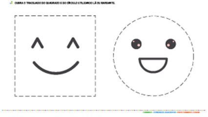
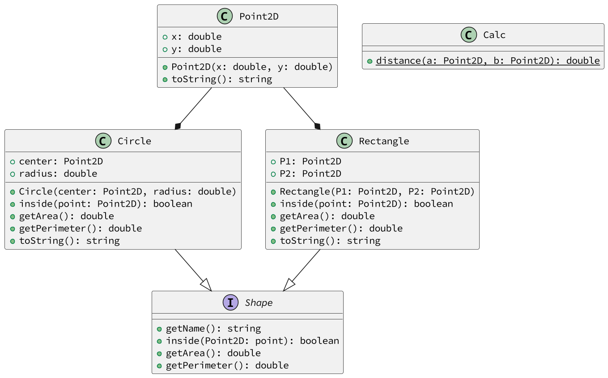

# Shapes



[](toc)

- [Intro](#intro)
- [Guide](#guide)
- [Shell](#shell)
[](toc)

- Faça um programa para gerenciar figuras geométricas.
- Deve ser possível conseguir obter a área e o perímetro de cada figura.
- Também deve ser possível checar se um ponto está dentro de uma figura ou não.

## Intro

As figuras geométricas podem ser círculos ou retângulos.

O retângulo é definido por dois pontos: o ponto inferior esquerdo e o ponto superior direito.

O círculo pode ser definido pelo ponto do centro e pelo raio.

## Guide



[](load)[](diagrama.puml)[](fenced:filter:plantuml)

```plantuml

class Point2D {
    + x: double
    + y: double

    ' gera uma string no formato
    ' (0.00, 0.00)
    + toString(): string
}

class Calc {
    ' método estático para calcular a distância entre dois pontos
    + {static} distance(a: Point2D, b: Point2D): double
}

class Shape {
    + name: string

    + Shape(name: string)
    
    ' getName(): string
    + getName(): string

    ' os métodos abaixo não são implementadas
    ' na classe Shape, apenas nas classes filhas

    ' retorna se o ponto está dentro da forma
    + {abstract} inside(Point2D: point): boolean

    ' retorna a área da forma
    + {abstract} getArea(): double

    ' retorna o perímetro da forma
    + {abstract} getPerimeter(): double

    ' retorna apenas o nome
    + toString(): string
}

class Circle {
    + center: Point2D
    + radius: double

    __
    ' invoca o construtor da superclasse
    ' passando o nome Circ
    ' guarda os outros valores nos atributos
    ' da classe Circle
    + Circle(center: Point2D, radius: double)

    ' implementa os métodos abstratos
    + inside(point: Point2D): boolean
    + getArea(): double
    + getPerimeter(): double

    ' retorna o nome da classe e os valores no seguinte formato
    ' Circ: C=(0.00, 0.00), R=0.00
    ' O ponto deve ser gerado pelo método toString da classe Point2D
    + toString(): string
}

class Rectangle {
    ' ponto superior esquerdo
    + P1: Point2D
    ' ponto inferior direito
    + P2: Point2D

    __
    ' invoca o construtor da superclasse
    ' passando o nome Rect
    ' inicializa o resto dos atributos
    + Rectangle(P1: Point2D, P2: Point2D)

    ' implementa os métodos abstratos
    + inside(point: Point2D): boolean
    + getArea(): double
    + getPerimeter(): double

    ' retorna o nome da classe e os valores no seguinte formato
    ' Rect: P1=(0.00, 0.00) P2=(0.00, 0.00)
    + toString(): string
}

```

[](load)

## Shell

```sh
#__case creating figures
$circle 2 3 5

#__case showing
$show
Circ: C=(2.00, 3.00), R=5.00

#__case creating more figures
$rect 1 1 3 3
$rect 2 4.53 5 10
$circle 1 1 1.5

#__case showing all
$show
Circ: C=(2.00, 3.00), R=5.00
Rect: P1=(1.00, 1.00) P2=(3.00, 3.00)
Rect: P1=(2.00, 4.53) P2=(5.00, 10.00)
Circ: C=(1.00, 1.00), R=1.50


#__case showing area and perimeter
$info
Circ: A=78.54 P=31.42
Rect: A=4.00 P=-8.00
Rect: A=16.41 P=-16.94
Circ: A=7.07 P=9.42

$end
```
