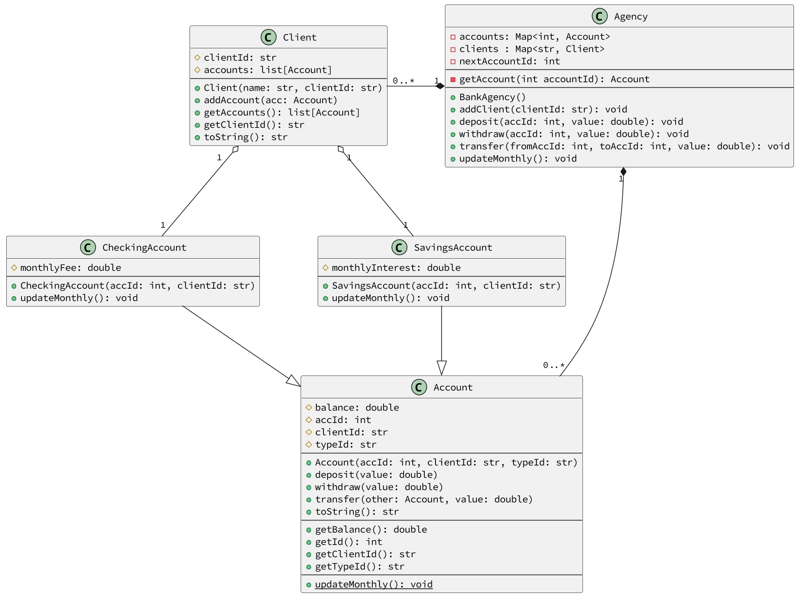

# Crie as contas poupança e corrente

<!-- toch -->
[Vídeo](#vídeo) | [Intro](#intro) | [Draft](#draft) | [Guide](#guide) | [Shell](#shell)
-- | -- | -- | -- | --
<!-- toch -->


O objetivo dessa atividade é implementar uma agência bancária simplificada. Deve ser capaz de cadastrar cliente. Cada cliente inicia com uma conta poupança e uma conta corrente. Contas correntes tem taxa de administração e contas poupanças rendem juros.

## Vídeo

[](https://youtu.be/AfJ--C8ZqPY)

## Intro

- Cadastrar um cliente com idCliente único
  - Quando o cliente é cadastrado no sistema, automaticamente é aberta uma conta corrente e uma conta poupança para ele.
- Mensalmente:
  - Contas corrente vão receber uma tarifa de **20 reais** podendo inclusive ficar negativas.
  - Contas poupança vão aumentar de 1 porcento.
- Sua agência deve ter um mapa de clientes e um mapa de contas.
- O cliente só tem duas contas, mas imagine que no futuro ele poderá ter várias.
- As contas devem ser tratadas utilizando polimorfismo.

## Draft

[draft.ts](.cache/draft.ts)

## Guide



[](https://youtu.be/2Mk5c6p-d20?si=M2XqjolrOL7Hw-C3)


<!-- load diagrama.puml fenced=ts:filter -->

```ts

@startuml

skinparam defaultFontName "Source Code Pro"
skinparam dpi 150


class Account {
    # balance: double
    # accId: int
    # clientId: str

    ' typeId {CC, CP}
    # typeId: str
    --
    ' inicializa os atributos
    ' saldo inicial é 0
    + Account(accId: int, clientId: str, typeId: str)

    ' realiza o depósito
    + deposit(value: double)

    ' realiza o saque
    ' verifique se há saldo suficiente
    + withdraw(value: double)

    ' realiza a transferência da conta this para conta other
    ' verifique se há saldo suficiente na conta this
    + transfer(other: Account, value: double)

    ' retorna as informações na conta no formato
    ' "accId:clientId:balance:typeId"
    + toString(): str
    --

    ' retorna o saldo
    + getBalance(): double

    ' retorna o id
    + getId(): int

    ' retorna o id do cliente
    + getClientId(): str

    ' retorna o tipo da conta
    + getTypeId(): str
    --
    
    ' método abstrato que realiza a atualização mensal da conta
    ' o método deve ser implementado nas subclasses
    + {static} updateMonthly(): void
}

class CheckingAccount {
    ' taxa de manutenção da conta
    # monthlyFee: double
    --
    ' chama o construtor da superclasse
    ' repassando os valores accId, clientId e typeId = CC
    + CheckingAccount(accId: int, clientId: str)

    ' decrementa o saldo da conta em monthlyFee
    + updateMonthly(): void
}

class SavingsAccount {
    ' taxa de rendimento mensal
    # monthlyInterest: double

    --
    ' chama o construtor da superclasse
    ' repassando os valores accId, clientId e typeId = CP
    + SavingsAccount(accId: int, clientId: str)

    ' incrementa o saldo da conta em monthlyInterest %
    + updateMonthly(): void  
}

class Client {
    # clientId: str
    # accounts: list[Account]
    --
    + Client(name: str, clientId: str)

    ' adiciona uma conta à lista de contas do cliente
    + addAccount(acc: Account)

    ' retorna a lista de contas do cliente
    + getAccounts(): list[Account]

    ' retorna o id do cliente
    + getClientId(): str

    ' retorna o nome do cliente e a lista com os ids das contas no formato
    ' nome [id1, id2, ...]
    + toString(): str
}

class Agency {
    - accounts: Map<int, Account>
    - clients : Map<str, Client>
    - nextAccountId: int
    --

    ' busca pela conta e dispara excessão se não encontrar
    - getAccount(int accountId): Account
    --
    ' inicializa os atributos
    + BankAgency()

    ' cria uma conta para o cliente
    ' cria um objeto cliente e insere no mapa de clientes
    ' cria uma conta corrente e uma conta polpança e insere no mapa de contas
    ' faz o vínculo cruzado colocando as contas dentro do objeto do cliente
    + addClient(clientId: str): void

    ' procura pela conta usando o getAccount e realiza a operação de depósito
    ' utiliza o método deposit da classe Account
    + deposit(accId: int, value: double): void

    ' procura pela conta e realiza a operação de saque
    ' utiliza o método withdraw da classe Account
    + withdraw(accId: int, value: double): void

    ' procura pela conta e realiza a operação de transferência
    ' utiliza o método transfer da classe Account
    + transfer(fromAccId: int, toAccId: int, value: double): void

    ' realiza a operação de atualização mensal em todas as contas
    + updateMonthly(): void
}


CheckingAccount --|> Account
SavingsAccount --|> Account

Client "1" o-- "1" CheckingAccount
Client "1" o-- "1" SavingsAccount

Agency "1" *-- "0..*" Account

Agency "1" *--l- "0..*" Client


' Circle --|> Shape
' Rectangle --|> Shape
' V2D  --  Circle
' V2D  --  Rectangle
@enduml

```

<!-- load -->

## Shell

```bash
#TEST_CASE first clients
# addCli _idCliente
# adiciona um cliente na lista de clientes.
# cria uma conta poupança e uma conta corrente para cada cliente usando numeração de forma sequencial.
$addCli Almir
$addCli Julia
$addCli Maria

# show mostra as contas do banco, com id:usuario:saldo:tipo
# em tipo use CC para conta corrente e CP para conta poupança.
$show
- Clients
Almir [0, 1]
Julia [2, 3]
Maria [4, 5]
- Accounts
0:Almir:0.00:CC
1:Almir:0.00:CP
2:Julia:0.00:CC
3:Julia:0.00:CP
4:Maria:0.00:CC
5:Maria:0.00:CP

######################################
#TEST_CASE operações básicas
#faça as operações básicas de saque, depósito e transferência entre contas
#verifique se as contas existem antes de efetuar as operações
# $saque _conta _value
# para sacar verifique o saldo
#
# $deposito _conta _value
#
# $transf _contaDe _contaPara _value

$deposito 0 100
$deposito 1 200
$deposito 2 50
$deposito 3 300
$saque 3 50
$saque 0 70
$saque 1 300
fail: saldo insuficiente

$show
- Clients
Almir [0, 1]
Julia [2, 3]
Maria [4, 5]
- Accounts
0:Almir:30.00:CC
1:Almir:200.00:CP
2:Julia:50.00:CC
3:Julia:250.00:CP
4:Maria:0.00:CC
5:Maria:0.00:CP

$transf 3 5 200
$transf 0 4 25
$transf 9 1 30
fail: conta nao encontrada
$transf 2 8 10
fail: conta nao encontrada

$show
- Clients
Almir [0, 1]
Julia [2, 3]
Maria [4, 5]
- Accounts
0:Almir:5.00:CC
1:Almir:200.00:CP
2:Julia:50.00:CC
3:Julia:50.00:CP
4:Maria:25.00:CC
5:Maria:200.00:CP

#TEST_CASE update mensal
# No comando update todas as contas serão atualizadas.
# Contas corrente vão receber uma tarifa de 20 reais podendo inclusive ficar negativas.
# Contas poupança vão aumentar de 1 porcento.
$update

$show
- Clients
Almir [0, 1]
Julia [2, 3]
Maria [4, 5]
- Accounts
0:Almir:-15.00:CC
1:Almir:202.00:CP
2:Julia:30.00:CC
3:Julia:50.50:CP
4:Maria:5.00:CC
5:Maria:202.00:CP

$end

```

***
