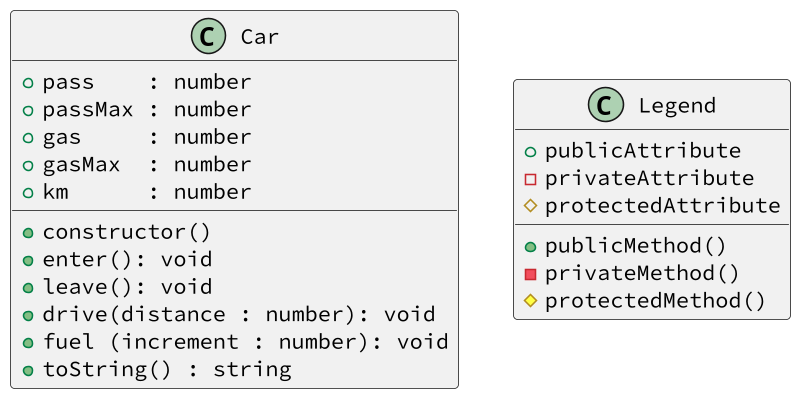

# Um carro simples

<!-- toch -->
[Intro](#intro) | [Guide](#guide) | [Shell](#shell) | [Draft](#draft)
-- | -- | -- | --
<!-- toch -->


## Intro

Nesta atividade, vamos implementar um carro ecológico. Ele deve ser capaz de embarcar e desembarcar pessoas, abastecer e andar.

- O carro deve ser inicializado com o tanque vazio, sem ninguém dentro e com 0 quilômetros percorridos. Suporta até 2 pessoas e até 100 litros de combustível.
- Construtor do Carro
  - `pass`: 0 passageiros.
  - `km`: 0 quilômetros percorridos.
  - `passMax`: Máximo de 2 pessoas.
  - `gas`: 0 litros de gasolina.
  - `gasMax`: Máximo de 100 litros de gasolina.
- Mostrar `$show`
  - Imprime a chamada do método `toString` do carro.
  - `toString` - Retorna uma string com o estado atual do carro no formato:
  - `"pass:{pass}, gas:{gas}, km:{km}"`.
- Entrar `$enter`
  - Embarca uma pessoa por vez, mas não além do máximo.
  - Se o carro estiver lotado, emite a mensagem de erro.
    - `fail: limite de pessoas atingido`.
- Sair `$leave`
  - Desembarca uma pessoa por vez.
  - Se não houver ninguém no carro, emite a mensagem de erro.
    - `fail: nao ha ninguem no carro`.
- Abastecer certa quantidade `$fuel increment`
  - Abastece o tanque com a quantidade de litros de combustível passada.
  - Caso tente abastecer acima do limite, descarta o valor excedente.
- Dirigir certa distância `$drive distance`
  - Para dirigir, o carro consome combustível e aumenta a quilometragem.
  - Só pode dirigir se houver combustível e se houver alguém no carro.
  - Caso não haja ninguém no carro, emite a mensagem de erro.
    - `fail: não há ninguém no carro`
  - Caso não haja combustível, emite a mensagem de erro.
    - `fail: tanque vazio`
  - Caso não exista combustível suficiente para completar a viagem inteira, dirija o máximo possível e emite uma mensagem indicando quanto foi percorrido
    - `fail: tanque vazio após andar {distancia} km`.

## Guide

[](https://youtu.be/LM6KM4eLi3U)


- Implemente a sua classe se orientando pela descrição, pelo UML(se houver) e pelos testes cadastrados.
- Começe analisando os testes e entendendo tudo que seu código precisa fazer.
- Depois que tiver uma ideia do que vai implementar, se deixe guiar pelos testes, implementando apenas o que é pedido para passar em cada teste.
- Passe para o próximo teste até implementar tudo que é pedido.



## Shell

```bash
#TEST_CASE inicializar
$show
pass: 0, gas: 0, km: 0

#TEST_CASE entrar
$enter
$enter
$show
pass: 2, gas: 0, km: 0

#TEST_CASE limite
$enter
fail: limite de pessoas atingido
$show
pass: 2, gas: 0, km: 0

#TEST_CASE sair
$leave
$show
pass: 1, gas: 0, km: 0

#TEST_CASE limite saida
$leave
$leave
fail: nao ha ninguem no carro
$show
pass: 0, gas: 0, km: 0
$end
```

***

```bash
#TEST_CASE abastecer
$fuel 60
$show
pass: 0, gas: 60, km: 0

#TEST_CASE dirigir vazio
$drive 10
fail: nao ha ninguem no carro

#TEST_CASE dirigir
$enter
$drive 10
$show
pass: 1, gas: 50, km: 10

#TEST_CASE para longe
$drive 70
fail: tanque vazio apos andar 50 km
$drive 10
fail: tanque vazio
$show
pass: 1, gas: 0, km: 60

#TEST_CASE enchendo o tanque
$fuel 200
$show
pass: 1, gas: 100, km: 60
$end
#
```

## Draft

<!-- links .cache/draft -->
- cpp
  - [shell.cpp](.cache/draft/cpp/shell.cpp)
- java
  - [Shell.java](.cache/draft/java/Shell.java)
- ts
  - [shell.ts](.cache/draft/ts/shell.ts)
<!-- links -->
