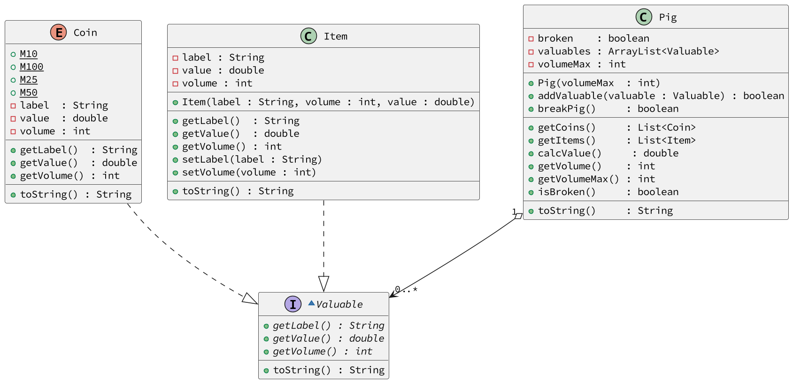

# @cofre - Seu porquinho cresceu

<!-- toch -->
[Intro](#intro) | [Draft](#draft) | [Guide](#guide) | [Shell](#shell)
-- | -- | -- | --
<!-- toch -->


## Intro

O sistema deverá:

- Gerenciar um cofrinho do tipo Porquinho capaz de guardar moedas e itens.
- As moedas devem ser criadas através de uma `enum`.
- Ambos moedas e itens deve implementar a Interaface `Valuable`.
- O volume do cofre incrementa conforme ele recebe itens e moedas.
- A lógica da utilização do cofre é:
  - Para inserir moedas e itens, o cofre deve estar inteiro.
  - Para obter moedas e itens, o cofre deve estar quebrado.
  - Ao quebrar, o volume do porco deve ser zerado e o status de broken deve ser alterado para `true`.
  - Ao obter moedas e itens, você deve retornar os objetos armazenados.
  - Calcular o valor e o volume atual do porco deve ser feito através do método getValue() e getVolume().
  - Moedas e Itens devem ser armazenados em uma mesma lista de Valuables.

***

## Draft

- [draft.java](.cache/draft.java)
- [draft.cpp](.cache/draft.cpp)
- [draft.ts](.cache/draft.ts)

## Guide



<!-- load diagrama.puml fenced=ts:filter -->

```ts

~interface Valuable {
  + getLabel() : String {abstract}
  + getValue() : double {abstract}
  + getVolume() : int {abstract}
  __
  + toString() : String
}

enum Coin {
  + M10 {static}
  + M100 {static}
  + M25 {static}
  + M50 {static}
  - label  : String
  - value  : double
  - volume : int
  __
  + getLabel()  : String
  + getValue()  : double
  + getVolume() : int
  __
  + toString() : String
}

class Item {
  - label : String
  - value : double
  - volume : int
  __
  + Item(label : String, volume : int, value : double)
  __
  + getLabel()  : String
  + getValue()  : double
  + getVolume() : int
  + setLabel(label : String)
  + setVolume(volume : int)
  __
  + toString() : String
}

class Pig {
  - broken    : boolean
  - valuables : ArrayList<Valuable>
  - volumeMax : int
  __
  
  ' inicializa as variaveis
  + Pig(volumeMax  : int)
  
  ' verifica se ainda cabe e se couber
  ' adiciona o elemento no final da lista
  + addValuable(valuable : Valuable) : boolean
  
  ' quebra se já não estiver quebrado
  + breakPig()     : boolean
  __
  
  ' se estiver quebrado
  ' pega apenas as moedas, retira-as
  ' da lista de valuables e as retorna
  + getCoins()     : List<Coin>

  ' retira e retorna apenas os itens
  + getItems()     : List<Item>

  ' percorre o vetor de valuables
  ' somando o valor de todos os elementos
  + calcValue()     : double

  ' percorre o vetor de valuables
  ' somando o volume de todos os elementos
  + getVolume()    : int

  ' retorna o volume max
  + getVolumeMax() : int

  ' retorna se esta quebrado
  + isBroken()     : boolean
  __
  + toString()     : String
}
```

<!-- load -->

***

## Shell

```sh
#TEST_CASE init
$init 20
$show
[] : 0.00$ : 0/20 : intact

#TEST_CASE insert
$addCoin 10
$show
[M10:0.10:1] : 0.10$ : 1/20 : intact

$addCoin 50
$show
[M10:0.10:1, M50:0.50:3] : 0.60$ : 4/20 : intact

#TEST_CASE itens
$addItem ouro 50.0 3
$show
[M10:0.10:1, M50:0.50:3, ouro:50.00:3] : 50.60$ : 7/20 : intact

$addItem passaporte 0.0 2
$show
[M10:0.10:1, M50:0.50:3, ouro:50.00:3, passaporte:0.00:2] : 50.60$ : 9/20 : intact

#TEST_CASE failed break
$extractItems
fail: you must break the pig first

$extractCoins
fail: you must break the pig first

$show
[M10:0.10:1, M50:0.50:3, ouro:50.00:3, passaporte:0.00:2] : 50.60$ : 9/20 : intact

#TEST_CASE breaking
$break
$show
[M10:0.10:1, M50:0.50:3, ouro:50.00:3, passaporte:0.00:2] : 50.60$ : 0/20 : broken

#TEST_CASE extractItems

$extractItems
[ouro:50.00:3, passaporte:0.00:2]

$show
[M10:0.10:1, M50:0.50:3] : 0.60$ : 0/20 : broken

#TEST_CASE extractCoins

$extractCoins
[M10:0.10:1, M50:0.50:3]

$show
[] : 0.00$ : 0/20 : broken
$end
```

```sh
#TEST_CASE
$init 10

$break

$addCoin 10
fail: the pig is broken

$show
[] : 0.00$ : 0/10 : broken

$addItem bilhete 0.00 2
fail: the pig is broken

$show
[] : 0.00$ : 0/10 : broken

$end
```

```sh
#TEST_CASE full coin
$init 5

$addCoin 10
$addCoin 25
$show
[M10:0.10:1, M25:0.25:2] : 0.35$ : 3/5 : intact

$addCoin 50
fail: the pig is full

$show
[M10:0.10:1, M25:0.25:2] : 0.35$ : 3/5 : intact

#TEST_CASE full item
$addItem ouro 100.0 1

$show
[M10:0.10:1, M25:0.25:2, ouro:100.00:1] : 100.35$ : 4/5 : intact

$addItem pirulito 5.50 2
fail: the pig is full

$show
[M10:0.10:1, M25:0.25:2, ouro:100.00:1] : 100.35$ : 4/5 : intact

$end
```
