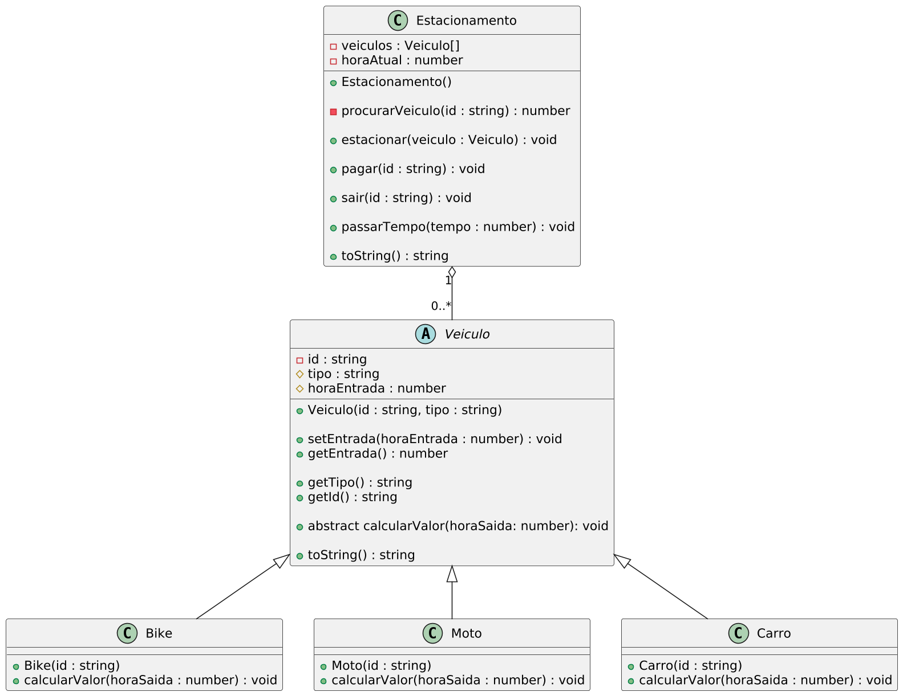

# Cobrando o valor de carros e motos

<!-- toch -->
[Intro](#intro) | [Guide](#guide) | [Shell](#shell) | [Draft](#draft)
-- | -- | -- | --
<!-- toch -->


## Intro

O sistema de estacionamento é responsável por gerenciar veículos em um estacionamento, registrando a entrada e saída de veículos, calculando o valor a ser pago pelo tempo de permanência e fornecendo informações sobre os veículos estacionados.

- Você deve utilizar herança para construir um sistema para gerenciar um estacionamento de bicicletas, carros e motos.
- A classe Veículo é uma classe abstrata que possui os atributos `id`, `entrada` e `tipo`.
- A classe Veículo possui um método abstrato `calcularValor()` que deve ser implementado pelas classes filhas.
- A classe Veículo possui um método `toString()`.

### Responsabilidades

- **Registrar Entrada de Veículo:**
  - O sistema deve permitir que novos veículos entrem no estacionamento, registrando o tipo de veículo e seu identificador.
  - O tempo de entrada do veículo deve ser registrado.

- **Registrar Saída de Veículo:**
  - O sistema deve permitir que veículos saiam do estacionamento, registrando o tempo de saída do veículo.
  - Com base no tempo de entrada e saída, o sistema deve calcular o valor a ser pago pelo estacionamento.

- **Calcular Valor a Pagar:**
  - O valor a ser pago pelo estacionamento é calculado com base no tipo de veículo estacionado e no tempo de permanência.
  - O cálculo do valor varia de acordo com o tipo de veículo:
    - **Bike:** paga R$3 fixos.
    - **Moto:** paga o valor em minutos dividido por 20.
    - **Carro:** paga o valor em minutos dividido por 10, mas o valor mínimo é 5.00.

- **Obter Lista de Veículos Estacionados:**
  - O sistema deve ser capaz de fornecer uma lista de todos os veículos atualmente estacionados, incluindo o tipo de veículo, identificador e tempo de entrada.

## Guide



[](https://youtu.be/PBabGC5nlPE?si=NgkxkLArCDVx52fJ)


Você pode controlar o alinhamento e preenchimento com "_" que o método `toString()` deve retornar assim.

```cpp
//cpp
virtual string toString() const {
    stringstream ss;
    ss << setw(10) << setfill('_') <<  tipo << " : " << setw(10) << setfill('_') << id << " : " << entrada;
    return ss.str();
}
```

```java
//java
//Em java não existe método de alinhamento que permite escolher o caracter de preenchimento
//Então vamos fazer uma adaptação
public String toString() {
    return String.format(
        "%10s-:-%10s-:-%s", //alinhar a direita 10 caracteres inserindo espaços
        this.tipo,
        this.id,
        this.horaEntrada
    )
        .replace(' ', '_') //substituir espaço por underline
        .replace('-', ' '); //substituir hífen por espaço
}
```

```ts
//ts
toString(): string {
    return this.tipo.padStart(10, "_") + " : " + this.id.padStart(10, "_") + " : " + this.entrada;
}
```

## Shell

```sh

#TEST_CASE entrada bike
$show
Hora atual: 0
$tempo 30
$estacionar bike elias
$show
______Bike : _____elias : 30
Hora atual: 30

#TEST_CASE entrada moto
$tempo 20
$estacionar moto abc1234
$show
______Bike : _____elias : 30
______Moto : ___abc1234 : 50
Hora atual: 50
#TEST_CASE entrada carro
$tempo 50
$estacionar carro pog1000
$show
______Bike : _____elias : 30
______Moto : ___abc1234 : 50
_____Carro : ___pog1000 : 100
Hora atual: 100
$tempo 100
$estacionar carro uva9999
$tempo 30
$show
______Bike : _____elias : 30
______Moto : ___abc1234 : 50
_____Carro : ___pog1000 : 100
_____Carro : ___uva9999 : 200
Hora atual: 230

#TEST_CASE saida
$pagar elias
Bike chegou 30 saiu 230. Pagar R$ 3.00
$pagar abc1234
Moto chegou 50 saiu 230. Pagar R$ 9.00
$pagar pog1000
Carro chegou 100 saiu 230. Pagar R$ 13.00
$pagar uva9999
Carro chegou 200 saiu 230. Pagar R$ 5.00
$end
```

## Draft

<!-- links .cache/draft -->
- cpp
  - [shell.cpp](.cache/draft/cpp/shell.cpp)
- java
  - [Shell.java](.cache/draft/java/Shell.java)
- ts
  - [shell.ts](.cache/draft/ts/shell.ts)
<!-- links -->
