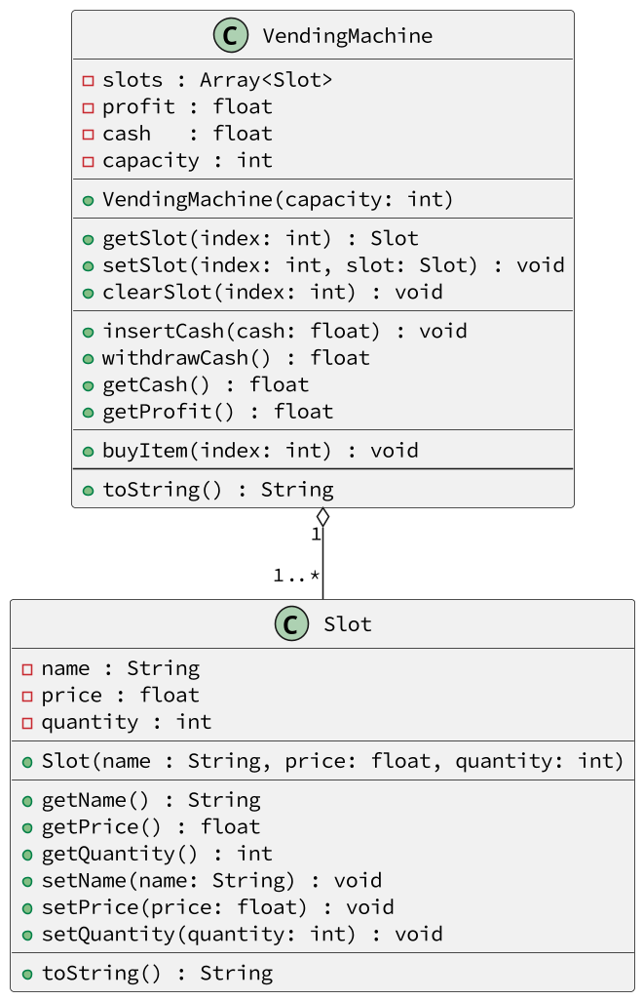

# Comprando comida em uma máquina de @junkfood

<!-- toch -->
[Intro](#intro) | [Draft](#draft) | [Guide](#guide) | [Shell](#shell) | [Resolução](#resolução)
-- | -- | -- | -- | --
<!-- toch -->


Máquinas de junk food só servem pra 2 coisas, 1 vender comidas que fazem mal pra saúde, 2 rejeitar as notas velhas que você tem.

O objetivo dessa atividade é implementar uma classe responsável por uma máquina de vender JunkFood. Na máquina existem várias espirais (slots). Uma espiral contém uma certa quantidade de produtos do mesmo tipo e mesmo preço. O usuário coloca o dinheiro, compra o produto e recebe o troco.

## Intro

Seu sistema deverá ser capaz de:

- **Iniciando a máquina**
  - Iniciar a máquina definindo o número de espirais.
    - Se já houver uma máquina, então apague tudo e inicie uma nova máquina.
  - Mostrar o conteúdo de cada espiral.
    - Índice, nome do produto, quantidade de produtos e preço.
    - Coloque um "empty" no nome do produto para informar que não há produto definido.

- **Algo pra comer**
  - Definir quais produtos há em cada espiral passando as informações do produto.

- **Resetar uma espiral**
  - Limpar todas as informações da espiral voltando ao seu estado original.

- **Dinheiro vai**
  - Inserir dinheiro na espiral.
    - Abstraia como o dinheiro vai. Crédito, débito, bitcoin, cédula nova ou velha.
  - Receba o dinheiro do usuário e vá adicionando ao saldo.
  - Alterar o mostrar máquina para mostrar o saldo também.

- **Comida vem, Dinheiro vem, Erros também**
  - Permitir que o cliente possa comprar um produto de uma espiral.
    - Verificar se a espiral existe.
    - Verificar se existe o produto e se o valor do pagamento é suficiente.
    - Tratar todos esses erros.
    - Mostrar o nome do produto que ele pediu.
  - Quando o cliente pedir o troco, mostre o quanto ele tinha de saldo e zere o saldo.

***

## Draft

- [draft.cpp](.cache/draft.cpp)
- [draft.ts](.cache/draft.ts)

## Guide



<!-- load diagrama.puml fenced=ts:filter -->

```ts
class Slot {
    - name : String
    - price : float
    - quantity : int
    __
    + Slot(name : String, price: float, quantity: int)
    __
    + getName() : String
    + getPrice() : float
    + getQuantity() : int
    + setName(name: String) : void
    + setPrice(price: float) : void
    + setQuantity(quantity: int) : void
    __
    + toString() : String
}

class VendingMachine {
    - slots : Array<Slot>
    - profit : float
    - cash   : float
    - capacity : int
    __

    ' inicialize a máquina criando todos os slots
    + VendingMachine(capacity: int)
    __

    ' se houver slot nessa posição, retorne
    ' se não, retorne null ou lançe uma excessão
    + getSlot(index: int) : Slot

    ' altere o valor slot nessa posição
    + setSlot(index: int, slot: Slot) : void

    ' limpe as informações do slot nessa posição
    + clearSlot(index: int) : void
    __

    ' adicione dinheiro no cash da máquina
    + insertCash(cash: float) : void

    ' retorne o valor do cash da máquina e zere o cash
    + withdrawCash() : float

    ' informe o valor do cash sem zerar o cash
    + getCash() : float

    ' informe o valor apurado com todas as vendas
    + getProfit() : float
    __

    ' se existir produto nessa posição
    ' se o dinheiro do cash for suficiente
    ' se a quantidade do produto for maior que zero
    ' deduza da quantidade 1
    ' deduza do cash o valor do produto
    + buyItem(index: int) : void
    --
    + toString() : String
}
```

<!-- load -->

***

- Faça primeiro a classe Espiral.
- No construtor da class Maquina receba a quantidade de espirais. Para iniciar o vetor de espirais você pode fazer um laço inserindo qtd Espirais no vetor (Java).

- Exemplo em Java

```java
class Espiral{
    ...
    public Espiral({
    ...
    }
}

class Machine{
    ...
    espirais : ArrayList<Espiral>;
    public Machine(nespirais : number){
        this.espirais = new ArrayList<>();
        for(int i = 0; i < nespirais; i++){
            this.espirais.add(new Espiral("empty", 0, 0f)); //adicionando nespirais vazias
        }
    }
}
```

- Exemplo c++

```c++
//c++
class Espiral{
    //atributos
    Espiral(){
        //inicializacao
    }
}
class Maquina{
    std::vector<Espiral> espirais;
    //outros atributos
public:
    //invocando o construtor na lista de inicialização
    Maquina(int nespirais): espirais{nespirais}{ 
    }
}
```

## Shell

```bash
#__case init

# init _espirais
$init 3
$show
saldo: 0.00
0 [   empty : 0 U : 0.00 RS]
1 [   empty : 0 U : 0.00 RS]
2 [   empty : 0 U : 0.00 RS]

#__case inserindo comida
# set _ind _nome _qtd _valor 
$set 2 todinho 3 2.50
$show
saldo: 0.00
0 [   empty : 0 U : 0.00 RS]
1 [   empty : 0 U : 0.00 RS]
2 [ todinho : 3 U : 2.50 RS]

$set 0 tampico 1 1.50
$set 1 xaverde 3 5.00
$show   
saldo: 0.00
0 [ tampico : 1 U : 1.50 RS]
1 [ xaverde : 3 U : 5.00 RS]
2 [ todinho : 3 U : 2.50 RS]

#__case limpando
# limpar _ind
$limpar 2
$show
saldo: 0.00
0 [ tampico : 1 U : 1.50 RS]
1 [ xaverde : 3 U : 5.00 RS]
2 [   empty : 0 U : 0.00 RS]
$set 4 ovo 2 4.30
fail: indice nao existe

#__case dinheiro
# dinheiro _valor
$dinheiro 5
$dinheiro 4
$show   
saldo: 9.00
0 [ tampico : 1 U : 1.50 RS]
1 [ xaverde : 3 U : 5.00 RS]
2 [   empty : 0 U : 0.00 RS]

#__case troco
$troco
voce recebeu 9.00 RS
$show
saldo: 0.00
0 [ tampico : 1 U : 1.50 RS]
1 [ xaverde : 3 U : 5.00 RS]
2 [   empty : 0 U : 0.00 RS]
$dinheiro 8

#__case comprar
# comprar _ind
$comprar 1
voce comprou um xaverde

#__case comprar sem dinheiro
$comprar 1
fail: saldo insuficiente

#__case comprar
$comprar 0
voce comprou um tampico
$show
saldo: 1.50
0 [ tampico : 0 U : 1.50 RS]
1 [ xaverde : 2 U : 5.00 RS]
2 [   empty : 0 U : 0.00 RS]

#__case comprar sem produtos
$comprar 0
fail: espiral sem produtos

#__case comprar fora do indice
$comprar 4
fail: indice nao existe

$troco
voce recebeu 1.50 RS
$end
#__end__
```

## Resolução

Não assista sem antes tentar resolver o problema: [LINK](https://youtu.be/wabygPIeP2w)
