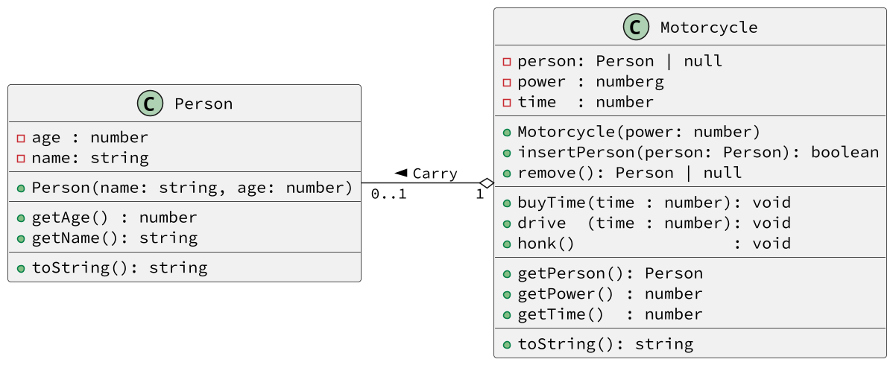

# Crianças andando de motoca

<!-- toch -->
[Intro](#intro) | [Guide](#guide) | [Shell](#shell) | [Draft](#draft)
-- | -- | -- | --
<!-- toch -->


## Intro

Este é um projeto de modelagem e implementação de uma motoca motorizada em um parque. A ideia é simular o funcionamento dessa motoca através de classes em um programa. Para isso, serão implementadas duas classes principais: `Pessoa` e `Moto`.

- Descrição
  - A classe `Moto` representa a motoca em si. Ela possui atributos como potência, tempo e a pessoa que está atualmente utilizando-a.
  - A motoca inicia com potência 1, sem minutos e sem ninguém.
  - Apenas uma pessoa pode estar na motoca por vez.
  - As funcionalidades principais da motoca incluem subir uma pessoa, descer uma pessoa, comprar tempo, dirigir por um tempo determinado e buzinar.
  - A classe `Pessoa` representa os usuários da motoca. Ela possui os atributos nome e idade.
- Comandos
  - Todos os comandos seguem o modelo `$comando arg1 arg2 ...`. Em caso de erro, uma mensagem adequada deve ser impressa.
  - `$show` - Mostra o estado atual da motoca, incluindo potência, tempo e pessoa atualmente na motoca.
    - `f"power:{this.power}, time:{this.time}, person:{this.person}"`
    - power:1, time:0, person:(marcos:4)
  - `$init` - Reinicia a motoca para o estado inicial, com potência 1, sem minutos e sem ninguém.
  - `$enter` - Permite uma pessoa subir na motoca. Deve ser seguido pelos argumentos `nome` e `idade` da pessoa.
  - `$leave` - Faz a pessoa atualmente na motoca descer.
  - `$buy` - Permite comprar tempo em minutos para utilizar a motoca. O tempo recebido é incrementado ao tempo atual. 
  - `$drive` - Permite dirigir a motoca por um tempo determinado.
  - `$honk` - Permite buzinar a motoca.

## Guide



- Classe Pessoa
  - Crie a classe `Pessoa` com os atributos `age` e `name`.
  - Defina os atributos como privados.
  - Crie o construtor da classe que recebe `name` como uma string e `age` como um número.
  - Crie os métodos `getAge()` e `getName()` para retornar a idade e o nome da pessoa, respectivamente.
  - Crie o método `toString()` para retornar uma string no formato "nome:idade".
- Parte 1: Inserir
  - Crie a classe `Motoca` com os atributos `potencia`, `time` e `pessoa`.
  - Inicialize os atributos no construtor, onde `potencia` inicia com 1, `time` inicia com 0 e `pessoa` inicia como nulo.
  - Crie o método `inserir(pessoa: Pessoa): boolean` que permite inserir uma pessoa na motoca.
  - Verifique se há uma pessoa na motoca. Se houver, imprima "fail: busy motorcycle" e retorne falso.
  - Caso contrário, insira a pessoa na motoca e retorne verdadeiro.
  - Crie o método `toString()` para mostrar o estado da motoca.
- Parte 2: Remover
  - Crie o método `remover(): Pessoa | null` que permite remover a pessoa da motoca.
  - Verifique se há uma pessoa na motoca. Se não houver, imprima "fail: empty motorcycle" e retorne nulo.
  - Caso contrário, remova a pessoa da motoca e retorne a pessoa removida.
- Parte 3: Comprar Tempo
  - Crie o método `buyTime(time: number)` que permite comprar tempo em minutos para utilizar a motoca.
  - Incremente o tempo da motoca com o tempo passado como parâmetro.
- Parte 4: Dirigir
  - Crie o método `drive(time: number)` que permite dirigir a motoca por um tempo determinado.
  - Verifique se há tempo disponível na motoca. Se não houver, imprima "fail: buy time first".
  - Verifique se há uma pessoa na motoca. Se não houver, imprima "fail: empty motorcycle".
  - Verifique se a idade da pessoa na motoca é maior que 10 anos. Se for, imprima "fail: too old to drive".
  - Calcule o novo tempo após dirigir. Se o novo tempo for menor ou igual a 0, imprima "fail: time finished after X minutes".
  - Atualize o tempo da motoca.
- Parte 5: Buzinar
  - Crie o método `honk()` que permite buzinar a motoca.
  - Construa a string da buzina, onde o número de "e" é igual à potência da motoca.
  - Retorne a buzina.
- Parte 6: Adapter
  - Na classe `Adapter`, crie um atributo `motoca` e o inicialize no construtor.
  - Nos outros métodos de `Adapter`, chame o método equivalente da classe `Motoca`.
  - No métode inserir, observe que o `Adapter` recebe os argumentos `nome` e `idade` e cria um objeto `Pessoa` para inserir na motoca.

```ts
// Arquivo adapter
  void inserir(String nome, int idade) {
    motoca.inserir(new Pessoa(nome, idade));
  }
```

***

## Shell

```s

#TEST_CASE subindo e buzinando
$show
power:1, time:0, person:(empty)

#TEST_CASE subindo
$enter marcos 4
$show
power:1, time:0, person:(marcos:4)

#TEST_CASE ocupada
$enter marisa 2
fail: busy motorcycle

$show
power:1, time:0, person:(marcos:4)
$end
```

```s
#TEST_CASE subindo2
$init 5
$show
power:5, time:0, person:(empty)

#TEST_CASE buzinando
$enter marcos 4
$show
power:5, time:0, person:(marcos:4)
$end
```

```s
#TEST_CASE subindo e trocando
$init 7
$enter heitor 6
$show
power:7, time:0, person:(heitor:6)
$leave
heitor:6

#TEST_CASE empty
$leave
fail: empty motorcycle
---

#TEST_CASE replace
$enter suzana 8
$show
power:7, time:0, person:(suzana:8)
$end
```

```s
#TEST_CASE no time
$init 7
$buy 30
$show
power:7, time:30, person:(empty)
$buy 10
$show
power:7, time:40, person:(empty)
$end
```

```s
#TEST_CASE buy time 
$init 7
$drive 10
fail: buy time first
$buy 50
#TEST_CASE empty
$drive 10
fail: empty motorcycle
$enter suzana 8

#TEST_CASE driving
$drive 30
$show
power:7, time:20, person:(suzana:8)
$end
```

```s
#TEST_CASE limite de idade
$init 7
$buy 20
$enter andreina 23
$drive 15
fail: too old to drive
$show
power:7, time:20, person:(andreina:23)
$end
```

```s
#TEST_CASE acabou o tempo
$init 7
$buy 20
$enter andreina 6
$drive 15
$show
power:7, time:5, person:(andreina:6)
$drive 10
fail: time finished after 5 minutes
$show
power:7, time:0, person:(andreina:6)
$end
```

```s
#TEST_CASE buzinando
$init 1
$honk
Pem
$init 5
$honk
Peeeeem
$end
```

## Draft

<!-- links .cache/draft -->
- cpp
  - [adapter.hpp](.cache/draft/cpp/adapter.hpp)
  - [fn.hpp](.cache/draft/cpp/fn.hpp)
  - [shell.cpp](.cache/draft/cpp/shell.cpp)
- java
  - [Adapter.java](.cache/draft/java/Adapter.java)
  - [Shell.java](.cache/draft/java/Shell.java)
- ts
  - [aashell.ts](.cache/draft/ts/aashell.ts)
  - [adapter.ts](.cache/draft/ts/adapter.ts)
<!-- links -->
