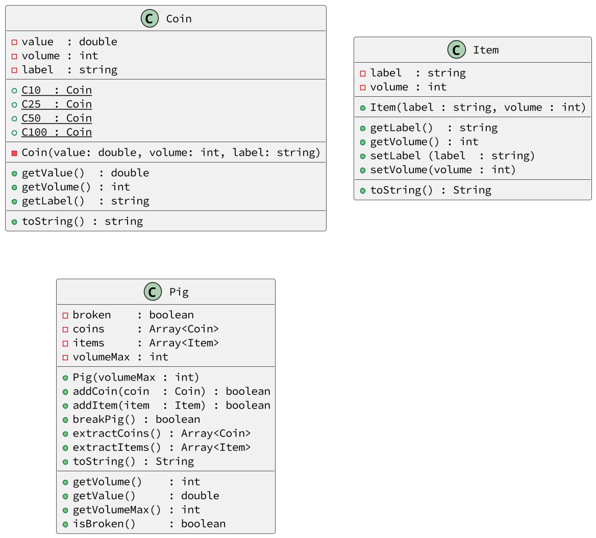

# @porquinho - Guardando moedas e itens em um cofrinho

<!-- toch -->
[Intro](#intro) | [Guide](#guide) | [Draft](#draft) | [Guide](#guide) | [Shell](#shell)
-- | -- | -- | -- | --
<!-- toch -->


## Intro

A classe Pig (Porquinho) representa um cofre que permite aos usuários adicionar moedas e itens, que são armazenados com base no volume disponível. O cofre tem uma capacidade máxima de volume e pode ser quebrado para extrair o conteúdo.

### Responsabilidades

- **Adicionar Moedas e Itens:**
  - Os usuários podem adicionar moedas e itens ao cofrinho.
  - A adição é limitada pela capacidade máxima de volume do porquinho.

- **Quebrar o Cofrinho:**
  - Os usuários podem quebrar o cofrinho para extrair seu conteúdo.
  - Uma vez quebrado, o cofrinho não pode mais receber adições.

- **Extrair Moedas e Itens:**
  - Após quebrar o cofrinho, os usuários podem extrair as moedas e itens armazenados.
  - As moedas e itens são removidos do cofrinho e retornados ao usuário.

- **Obter Valor e Volume Total:**
  - Os usuários podem verificar o valor total das moedas armazenadas no cofrinho.
  - Também podem verificar o volume total ocupado pelos itens e moedas.

## Guide

### Classe Coin

- A classe `Coin` possui os seguintes atributos:
  - `value`: Valor da moeda.
  - `volume`: Volume da moeda.
  - `label`: Rótulo da moeda.
- Além disso, a classe possui os seguintes métodos:
  - `toString(): string`: Retorna uma representação em string da moeda no formato `f"{this.value.2f}, {this.volume}"`
  - `getValue(): number`: Retorna o valor da moeda.
  - `getVolume(): number`: Retorna o volume da moeda.
  - `getLabel(): string`: Retorna o rótulo da moeda.

#### Método Estático

A classe `Coin` possui métodos estáticos para criar instâncias de moedas com valores pré-definidos:

```typescript
public static C10 = new Coin(0.10, 1, "C10");
public static C25 = new Coin(0.25, 2, "C25");
public static C50 = new Coin(0.50, 3, "C50");
public static C100 = new Coin(1.0, 4, "C100");
```

### Classe Item

A classe `Item` possui os seguintes atributos:

- `label`: Rótulo do item.
- `volume`: Volume do item.

Além disso, a classe possui os seguintes métodos:

- `getLabel(): string`: Retorna o rótulo do item.
- `getVolume(): number`: Retorna o volume do item.
- `setVolume(volume: number): void`: Define o volume do item.
- `setLabel(label: string): void`: Define o rótulo do item.
- `toString(): string`: Retorna uma representação em string do item.
  - Formato de retorno: `label:volume`

### Classe Pig

A classe `Pig` possui os seguintes atributos:

- `items`: Array de itens.
- `coins`: Array de moedas.
- `volumeMax`: Volume máximo suportado pela "cochonilha".
- `broken`: Indica se a "cochonilha" está quebrada ou não.

1. **Definição da Classe Pig:**

   - Definir a classe `Pig` com os atributos `items`, `coins`, `volumeMax` e `broken`.
   - Implementar o construtor que recebe `volumeMax` como parâmetro e o atribui à propriedade `volumeMax`.
   - Inicializar os arrays `items` e `coins` como vazios.
   - Inicializar a propriedade `broken` como `false`.

2. **Implementação dos Métodos:**

   - **Método `addCoin(coin: Coin): boolean`**
     - Aiciona uma moeda ao vetor de moedas.
     - Parâmetros:
       - `coin`: Moeda a ser adicionada.
     - Retorna `true` se a adição for bem-sucedida, caso contrário, retorna `false`.
     - Erro: `fail: the pig is broken` se o porquinho estiver quebrado.
     - Erro: `fail: the pig is full` se o porquinho estiver cheio.

   - **Método `addItem(item: Item): boolean`**
     - Adiciona um item ao vetor de itens.
     - Parâmetros:
       - `item`: Item a ser adicionado.
     - Retorna `true` se a adição for bem-sucedida, caso contrário, retorna `false`.
     - Erro: `fail: the pig is broken` se o porquinho estiver quebrado.
     - Erro: `fail: the pig is full` se o porquinho estiver cheio.

   - **Método `getVolume(): number`**
     - Retorna o volume total ocupado pelo conteúdo do porquinho.
         **Passos:**

    1. **Verificação de Estado:**
       - Verifica se o porquinho está quebrada.
         - Se estiver quebrado, retorna volume 0.

    2. **Cálculo do Volume:**
       - Inicializa a variável `volume` com valor 0.
       - Percorre o array de itens e adiciona o volume de cada item à variável `volume`.
       - Percorre o array de moedas e adiciona o volume de cada moeda à variável `volume`.
       - Retorna o valor total de `volume`.

   - **Método `getValue(): number`**
     - Retorna o valor total das moedas no porquinho.
     **Passos:**

    1. **Cálculo do Valor:**
       - Inicializa a variável `value` com valor 0.
       - Percorre o array de moedas e adiciona o valor de cada moeda à variável `value`.
       - Retorna o valor total de `value`.

   - **Método `breakPig(): boolean`**
     - Quebra o porquinho, tornando-o inutilizável.
     - Define a propriedade `broken` como `true`.
     - Retorna `true` se a quebra for bem-sucedida, caso contrário, retorna `false`.
     - Erro: `fail: the pig is already broken` se o porquinho já estiver quebrado.

   - **Método `extractCoins(): Coin[]`**
     - Remove e retorna todas as moedas do porquinho.
     - Retorna um array com todas as moedas removidas.
     - Erro: `fail: you must break the pig first` se o porquinho não estiver quebrado.

   - **Método `extractItems(): Item[]`**
     - Remove e retorna todos os itens do porquinho.
     - Retorna um array com todos os itens removidos.
     - Erro: `fail: you must break the pig first` se o porquinho não estiver quebrado.

   - **Método `toString(): string`**
     - Retorna uma representação em string do estado atual do porquinho, incluindo se está intacto ou quebrado, a lista de moedas e itens armazenados, o valor total e o volume ocupado.
     - Formato de retorno: `state=estado : coins=[moedas] : items=[itens] : value=valor : volume=volumeAtual/volumeMaximo`.

### Classe Adapter

A classe `Adapter` possui um atributo:

- `pig`: Objeto da classe `Pig`.

Além disso, a classe possui os seguintes métodos:

1. **Definição da Classe Adapter:**

   - Definir a classe `Adapter` com o atributo `pig`, que é um objeto da classe `Pig`.
   - Implementar o construtor que recebe `volumeMax` como parâmetro e inicializa o objeto `pig` com um novo objeto `Pig` passando `volumeMax` como argumento.

2. **Implementação dos Métodos:**

   - **Método `addCoin(value: number): void`**
     - Adiciona uma moeda ao porquinho usando o método `addCoin(coin: Coin)` da classe `Pig`.
     - Parâmetros:
       - `value`: Valor da moeda a ser adicionada.
     - Exemplo de uso em typescript:
       ```typescript
       if      (value === 10)   { this.pig.addCoin(Coin.C10); } // Adiciona uma moeda de 0.10 à ao porquinho
       ```

   - **Método `addItem(label: string, volume: number): void`**
     - Cria um item e adiciona ao porquinho usando o método `addItem(item: Item)` da classe `Pig`.
     - Parâmetros:
       - `label`: Rótulo do item a ser adicionado.
       - `volume`: Volume do item a ser adicionado.

   - **Método `breakPig(): void`**
     - Quebra o porquinho usando o método `breakPig()` da classe `Pig`.

   - **Método `extractItems(): string`**
     - Remove e retorna todos os itens do porquinho usando o método `extractItems()` da classe `Pig`.
     - Retorna uma string representando os itens removidos.

   - **Método `extractCoins(): string`**
     - Remove e retorna todas as moedas da "cochonilha" usando o método `extractCoins()` da classe `Pig`.
     - Retorna uma string representando as moedas removidas.

   - **Método `toString(): string`**
     - Retorna uma representação em string do estado do porquinho usando o método `toString()` da classe `Pig`.
     - Retorna uma string representando o estado atual do porquinho.
     - Exemplo de uso:
       ```typescript
       toString(); // Retorna uma representação em string do estado do porquinho.
       ```
***

## Draft

- [draft.cpp](.cache/draft.cpp)
- [draft.java](.cache/draft.java)
- [draft.ts](.cache/draft.ts)

## Guide



<!-- load diagrama.puml fenced=ts:filter -->

```ts

class Coin {
  - value  : double
  - volume : int
  - label  : string
  __
  ' static const Coin C10; //c++
  + {static} C10  : Coin
  + {static} C25  : Coin
  + {static} C50  : Coin
  + {static} C100 : Coin
  __
  - Coin(value: double, volume: int, label: string)
  __
  + getValue()  : double
  + getVolume() : int
  + getLabel()  : string
  __
  ' retorna value:volume
  + toString() : string
}

class Item {
  - label  : string
  - volume : int
  __
  + Item(label : string, volume : int)
  __
  + getLabel()  : string
  + getVolume() : int
  + setLabel (label  : string)
  + setVolume(volume : int)
  __
  ' retorna label:volume
  + toString() : String
}

class Pig {
  - broken    : boolean

  - coins     : Array<Coin>
  - items     : Array<Item>

  - volumeMax : int
  __
  
  ' inicializa o volumeMax
  + Pig(volumeMax : int)
  
  ' se nao estiver quebrado e couber, adicione a moeda ao vetor de moedas
  + addCoin(coin  : Coin) : boolean
  
  ' se não estiver quebrado e couber, adicione o item ao vetor de itens
  + addItem(item  : Item) : boolean
  
  ' se o porco não estiver quebrado, quebre o porco
  + breakPig() : boolean
  
  ' se estiver quebrado, pegue e retorne as moedas
  ' se não estiver quebrado, retorne um vetor vazio
  + extractCoins() : Array<Coin>
  
  ' se estiver quebrado, pegue e retorne os itens
  ' se não estiver quebrado, retorne um vetor vazio
  + extractItems() : Array<Item>
  
  ' retorna uma string com uma lista de itens, valor, volume / volumeMax, 
  ' e se o porquinho está quebrado ou não
  + toString() : String
  __
  ' se estiver quebrado
    ' retorne zero
  ' se não estiver quebrado
    ' percorre o vetor de moedas e o vetor de itens somando o volume de cada um
  + getVolume()    : int

  ' percorre o vetor de moedas somando o valor de cada moeda
  + getValue()     : double

  ' retorna o volumeMax
  + getVolumeMax() : int

  ' retorna se o porquinho está quebrado ou não
  + isBroken()     : boolean
}
```

<!-- load -->

***

## Shell

```py
#__case init
$init 20
$show
state=intact : coins=[] : items=[] : value=0.00 : volume=0/20

#__case insert
$addCoin 10
$addCoin 50
$show
state=intact : coins=[0.10:1, 0.50:3] : items=[] : value=0.60 : volume=4/20

#__case itens
$addItem ouro 3
$show
state=intact : coins=[0.10:1, 0.50:3] : items=[ouro:3] : value=0.60 : volume=7/20

$addItem passaporte 2
$show
state=intact : coins=[0.10:1, 0.50:3] : items=[ouro:3, passaporte:2] : value=0.60 : volume=9/20

#__case failed break
$extractItems
fail: you must break the pig first
[]

$extractCoins
fail: you must break the pig first
[]

$show
state=intact : coins=[0.10:1, 0.50:3] : items=[ouro:3, passaporte:2] : value=0.60 : volume=9/20

#__case breaking
$break
$show
state=broken : coins=[0.10:1, 0.50:3] : items=[ouro:3, passaporte:2] : value=0.60 : volume=0/20

#__case getItems

$extractItems
[ouro:3, passaporte:2]

$show
state=broken : coins=[0.10:1, 0.50:3] : items=[] : value=0.60 : volume=0/20

#__case getCoins

$extractCoins
[0.10:1, 0.50:3]

$show
state=broken : coins=[] : items=[] : value=0.00 : volume=0/20
$end
```

***

```sh
#__case
$init 10

$break

$addCoin 10
fail: the pig is broken


$show
state=broken : coins=[] : items=[] : value=0.00 : volume=0/10

$addItem bilhete 2
fail: the pig is broken

$show
state=broken : coins=[] : items=[] : value=0.00 : volume=0/10

$end
```

***

```sh
#__case full coin
$init 5

$addCoin 10
$addCoin 25
$show
state=intact : coins=[0.10:1, 0.25:2] : items=[] : value=0.35 : volume=3/5

$addCoin 50
fail: the pig is full

$show
state=intact : coins=[0.10:1, 0.25:2] : items=[] : value=0.35 : volume=3/5

#__case full item
$addItem ouro 1

$show
state=intact : coins=[0.10:1, 0.25:2] : items=[ouro:1] : value=0.35 : volume=4/5

$addItem pirulito 2
fail: the pig is full

$show
state=intact : coins=[0.10:1, 0.25:2] : items=[ouro:1] : value=0.35 : volume=4/5

$end
```
