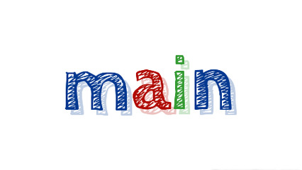

# Criando a Main



- Em c++:
  - Código: [main.cpp](main.cpp)

- Em java:
  - Código: [Main.java](Main.java)

- Em typescript:
  - Código: [main.ts](main.ts)

## Guide

O modelo básico da main é:

```py
def main():
    
    coisa = Coisa(); // Elemento a ser manipulado

    while True:
        print("$", end="");     // mostra '$' na frente
        line = input();         // lê a linha
        args = line.split(" "); // quebra em array de palavras
        write(line);            // mostra a linha lida

        if args[0] == "nome do comando":
            //aqui voce repassa os parametros para o objeto
            //convertendo os que precisam ser números ou inteiros
            coisa.funcaoTal(args[1], int(args[2]), args[3])

        elif args[0] == "outro comando":
            //outra invocacao
        elif args[0] == "end":
            break;
        else:
            write("fail: comando invalido");
```

## Shell

```s
#TEST_CASE teste simples
$show
[]

#TEST_CASE inserindo vários números em lote
$push 1 4 3 2
$show
[1, 4, 3, 2]

#TEST_CASE apagando por índice
$erase 1
$show
[1, 3, 2]

#TEST_CASE calculando a media
$media
2.00

$end
```
